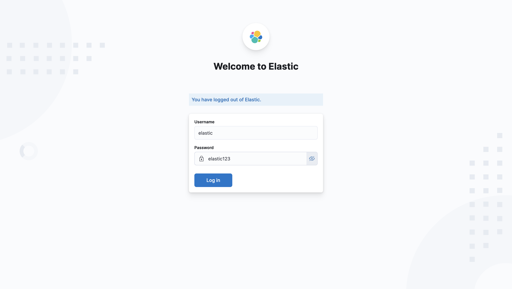

# Elastic Stack SIEM Deployment Guide

This guide provides step-by-step instructions for deploying the Elastic Stack SIEM solution using Docker.

## Prerequisites

- Linux distribution with Docker installed
- At least 4GB of RAM allocated to Docker
- Git (for cloning the repository)

```bash
sudo apt install docker-compose
```

## Step 1: Clone the Repository

```bash
sudo git clone https://github.com/Amid68/Elastic-SIEM-Project.git
```

## Step 2: Configure Environment Variables

1. Navigate to the project directory:
   ```bash
   cd Elastic-SIEM-Project
   ```

2. Create the `.env` file with the following content:
   ```bash
   sudo bash -c 'cat > .env << "EOL"
   # Environment variables for Elastic Stack SIEM deployment
   # Elasticsearch credentials
   ELASTIC_PASSWORD=elastic123
   # Elasticsearch heap size (adjust based on available memory)
   ES_JAVA_OPTS=-Xms512m -Xmx512m
   # Kibana settings
   KIBANA_ENCRYPTION_KEY=AQflBkD7h6iXZ08tv1BdenhUvDw7uInr17pnU6524q4=
   # Stack version
   STACK_VERSION=8.12.2
   # Set the cluster name
   CLUSTER_NAME=elastic-siem-cluster
   # Memory limits
   MEM_LIMIT=1073741824  # 1GB in bytes
   EOL'
   ```

3. If not on M1 Mac, remove or comment out the platform-specific settings in docker-compose.yml:
   ```bash
   # Open docker-compose.yml and comment out or remove lines containing:
   # platform: linux/arm64
   ```
## Step 3: Generate SSL Certificates
SSL certificates are required for secure communication between Elastic Stack components:

Run the certificate generation script:
```bash
sudo chmod +x generate_certs.sh
sudo ./generate_certs.sh
```
This script will:
- Create the necessary directories
- Generate a Certificate Authority (CA) certificate
- Generate a certificate for Elasticsearch
- The certificates will be stored in docker/elasticsearch/certs/

### IMPORTANT SECURITY NOTE: Never commit these certificates to version control. They contain sensitive private keys that should be kept secure.

## Step 4: Deploy the Elastic Stack

1. Start the Elasticsearch container:
   ```bash
   sudo docker-compose up -d elasticsearch
   ```

2. Wait for Elasticsearch to fully initialize (this may take a few minutes):
   ```bash
   sudo docker-compose logs -f elasticsearch
   ```
   
   Wait until you see logs indicating that the service is running properly. Note that a YELLOW status is normal for a single-node cluster.

## Step 5: Set Up Authentication

This critical step ensures that Kibana can successfully connect to Elasticsearch:

1. Once Elasticsearch is running, set up the built-in users:
   ```bash
   # Access the Elasticsearch container
   sudo docker exec -it elasticsearch bash

   # Set the password for the kibana_system user
   bin/elasticsearch-reset-password -u kibana_system --interactive
   # Enter the password "kibana123" when prompted

   # Also ensure the elastic superuser password matches your .env file
   bin/elasticsearch-reset-password -u elastic --interactive
   # Enter the password "elastic123" when prompted

   # Exit the container
   exit
   ```

## Step 6: Deploy Remaining Components

1. Deploy Kibana:
   ```bash
   sudo docker-compose up -d --no-deps kibana
   ```
   
   The `--no-deps` flag bypasses dependency checks that might incorrectly mark Elasticsearch as unhealthy.

2. After Kibana is running, deploy Logstash:
   ```bash
   sudo docker-compose up -d --no-deps logstash
   ```

3. Finally, deploy the Beats components:
   ```bash
   sudo docker-compose up -d --no-deps filebeat
   ```

## Step 7: Verify All Components Are Running

1. Check the status of all containers:
   ```bash
   sudo docker-compose ps
   ```

2. Check logs for any errors:
   ```bash
   sudo docker-compose logs kibana
   ```

3. If Kibana shows "server is not ready yet" or authentication failures:
   ```bash
   # Verify Elasticsearch is accessible from Kibana
   sudo docker exec -it kibana curl -u elastic:elastic123 http://elasticsearch:9200
   
   # If that fails, double-check your authentication setup from Step 4
   ```

## Step 8: Access Kibana

1. Open a web browser and navigate to:
   ```
   http://localhost:5601
   ```

2. Log in with the following credentials:
   - Username: `elastic`
   - Password: `elastic123`

### Start the first scenario
When you are ready move on to do the first scenario: [Detecting Brute Force Attack](./brute_force.md)
