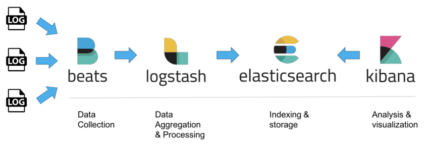
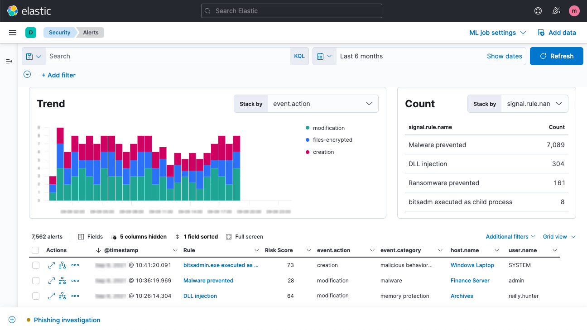
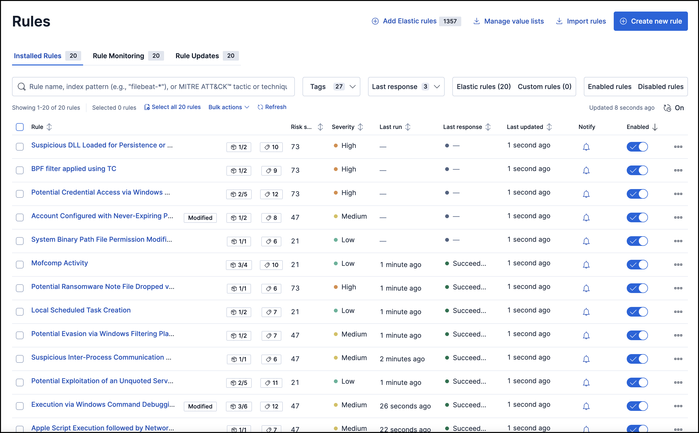

# Elastic SIEM Project

This repository contains the deployment configuration for an Elastic Stack SIEM (Security Information and Event Management) solution, designed to provide comprehensive security monitoring and alerting capabilities.

## What is the Elastic Stack?

The Elastic Stack (formerly known as the ELK Stack) is a collection of open-source projects that together provide a powerful platform for security analytics:

- **Elasticsearch**: A distributed, RESTful search and analytics engine capable of storing and analyzing large volumes of data in near real-time.
- **Logstash**: A server-side data processing pipeline that ingests, transforms, and enriches data from multiple sources simultaneously.
- **Kibana**: A visualization tool that provides charts, graphs, and dashboards for data stored in Elasticsearch.
- **Beats**: Lightweight data shippers that send data from edge machines to Logstash or Elasticsearch.

*Figure 2: Architecture of the Elastic Stack showing data flow between components*

## Components Used in This Project

### Core Components

1. **Elasticsearch (v8.12.2)**
   - Serves as the central data store for all security events and logs
   - Provides the search and analytics capabilities
   - Configured with security features enabled for authentication and authorization
   - Uses TLS/SSL for secure communications

2. **Kibana (v8.12.2)**
   - Provides the visualization interface for log and event data
   - Hosts the Security Solution (SIEM) application for threat detection and response
   - Allows creation of custom dashboards for security monitoring
   - Enables configuration of detection rules for security events

3. **Logstash (v8.12.2)**
   - Processes logs and events from various sources
   - Contains specialized filters for security event processing
   - Enriches security data with GeoIP information
   - Tags authentication events for easier analysis

4. **Filebeat (v8.12.2)**
   - Collects logs from Docker containers and system files
   - Monitors specific log files for security events
   - Ships logs to Logstash for processing
   - Adds metadata to events for better contextual information

### Simulation Components

For testing and demonstration purposes, this project includes:

1. **SSH Target**
   - A containerized SSH server 
   - Used as a target for simulated attacks
   - Configured to generate authentication logs

2. **Hydra Attacker**
   - Contains the Hydra password-cracking tool
   - Used to simulate brute-force attacks against the SSH target
   - Helps demonstrate SIEM detection capabilities

## Security Features

The Elastic Stack deployment in this project includes several security features:

- Authentication using built-in users and roles
- TLS/SSL encryption for data in transit
- Detection rules for common security threats
- GeoIP enrichment for network traffic analysis
- Alert generation for security events

*Figure 4: Security features implemented in the Elastic Stack SIEM*

## Directory Structure

- `docker-compose.yml`: Main Docker Compose file for deploying the Elastic Stack
- `elasticsearch/`: Configuration files for Elasticsearch
- `kibana/`: Configuration files for Kibana
- `logstash/`: Configuration files for Logstash and pipeline configurations
- `filebeat/`: Configuration files for Filebeat
- `.env`: Environment variables for Docker Compose
- `generate_certs.sh`: Script for generating SSL certificates for secure communications
- `simulation/`: Scripts for running security simulations

## Deployment Instructions

Detailed step-by-step instructions for deploying the Elastic Stack SIEM solution are provided in the [Deployment Guide](./DEPLOYMENT.md).

## SIEM Dashboard

Once deployed, the Elastic SIEM provides comprehensive security monitoring capabilities through its intuitive dashboard interface.

*Figure 5: Elastic SIEM dashboard showing security events and alerts*

## Detection Rules

The SIEM solution uses detection rules to identify potential security threats and generate alerts.

*Figure 6: Configuration of detection rules in Kibana*

## Security Scenarios

This project includes walkthroughs for common security scenarios:

1. [Detecting Brute Force Attacks](./brute_force.md): Learn how to detect and alert on SSH brute force attacks
