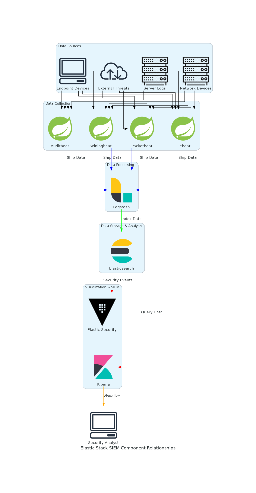
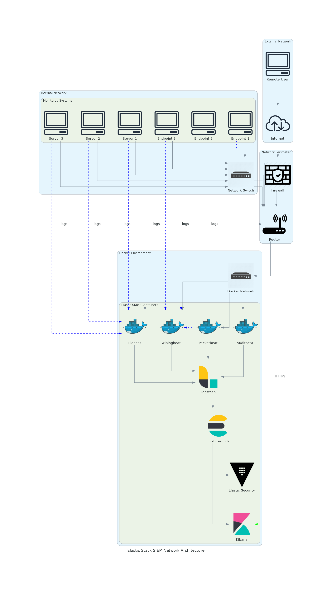

# Elastic Stack Architecture Design Document

## 1. Introduction

This document outlines the architecture design for implementing an Elastic Stack SIEM (Security Information and Event Management) solution. The design focuses on deployment using Docker containers on an M1 Mac environment, with considerations for cross-platform compatibility with Windows systems for other team members.

## 2. High-Level Architecture Overview

The Elastic Stack SIEM implementation consists of the following core components:

1. **Elasticsearch**: The distributed search and analytics engine that stores all the data
2. **Kibana**: The visualization platform for exploring and visualizing the data
3. **Logstash**: The data processing pipeline for ingesting, transforming, and enriching data
4. **Beats**: Lightweight data shippers for collecting various types of data
5. **Elastic Security**: The SIEM solution built on top of the Elastic Stack

These components work together to provide a comprehensive security monitoring and incident response platform.

## 3. Component Relationships

### 3.1 Data Flow

1. **Data Collection**: 
   - Beats agents (Filebeat, Winlogbeat, Packetbeat, etc.) collect data from various sources
   - Logstash receives data from Beats and other sources

2. **Data Processing**:
   - Logstash processes and transforms the data
   - Data enrichment occurs (e.g., GeoIP, threat intelligence)

3. **Data Storage**:
   - Elasticsearch indexes and stores the processed data
   - Data is organized into indices based on type and time

4. **Data Analysis and Visualization**:
   - Kibana provides dashboards and visualizations
   - Elastic Security provides SIEM capabilities
   - Alerts are generated based on detection rules

## 4. Detailed Component Specifications

### 4.1 Elasticsearch

- **Version**: 8.12.x (latest stable)
- **Configuration**:
  - 3-node cluster for production (single node for development/testing)
  - Dedicated master, data, and coordinating nodes in production
  - Appropriate memory allocation based on data volume
  - Secure communication with TLS/SSL
  - Role-based access control

### 4.2 Kibana

- **Version**: 8.12.x (matching Elasticsearch)
- **Configuration**:
  - Single instance (can be scaled horizontally in production)
  - Integration with Elasticsearch security features
  - SIEM-specific dashboards and visualizations
  - Custom dashboards for specific use cases

### 4.3 Logstash

- **Version**: 8.12.x (matching Elasticsearch)
- **Configuration**:
  - Multiple pipelines for different data sources
  - Data enrichment plugins (GeoIP, User Agent, etc.)
  - Output to Elasticsearch with appropriate index templates
  - Buffer configuration for handling spikes in data volume

### 4.4 Beats

- **Filebeat**: For collecting log files
- **Winlogbeat**: For Windows event logs
- **Packetbeat**: For network packet analysis
- **Auditbeat**: For audit framework data and file integrity monitoring
- **Metricbeat**: For system and service metrics

### 4.5 Elastic Security

- SIEM dashboards and workflows
- Detection engine with pre-built and custom rules
- Case management for incident response
- Timeline for investigation
- Integration with threat intelligence feeds

## 5. Network Architecture

### 5.1 Docker Network Configuration

- Dedicated Docker network for Elastic Stack components
- Proper port mapping for external access
- Network segmentation for security

### 5.2 Communication Flows

- Beats → Logstash: Port 5044 (Beats input)
- Logstash → Elasticsearch: Port 9200 (HTTP/HTTPS)
- Kibana → Elasticsearch: Port 9200 (HTTP/HTTPS)
- User → Kibana: Port 5601 (HTTP/HTTPS)

### 5.3 Security Considerations

- TLS/SSL encryption for all communications
- Network-level access controls
- Docker network isolation
- Minimal exposed ports

## 6. Scalability Considerations

### 6.1 Elasticsearch Scaling

- Horizontal scaling by adding data nodes
- Shard allocation for optimal performance
- Index lifecycle management for data retention

### 6.2 Logstash Scaling

- Multiple Logstash instances for high throughput
- Load balancing between instances
- Pipeline workers configuration

### 6.3 Kibana Scaling

- Multiple Kibana instances behind a load balancer (for production)

## 7. Security Considerations

### 7.1 Authentication and Authorization

- Built-in security features of Elastic Stack
- Role-based access control
- API keys for service accounts
- Integration with external authentication systems (optional)

### 7.2 Data Security

- Encryption at rest (for sensitive data)
- Encryption in transit (TLS/SSL)
- Audit logging for security events
- Regular security updates

### 7.3 Operational Security

- Secure Docker configuration
- Regular backups
- Monitoring of the Elastic Stack itself
- Alerting on security-related events

## 8. M1 Mac Specific Considerations

- Docker images compatible with ARM64 architecture
- Resource allocation appropriate for M1 Mac capabilities
- UTM for any necessary VM-based testing
- Performance optimization for ARM architecture

## 9. Implementation Phases

### 9.1 Phase 1: Basic Deployment

- Single-node Elasticsearch
- Basic Kibana setup
- Initial Logstash pipeline
- Basic Beats configuration

### 9.2 Phase 2: SIEM Configuration

- Elastic Security setup
- Detection rules configuration
- Dashboard creation
- Alert configuration

### 9.3 Phase 3: Testing and Validation

- Scenario implementation
- Detection testing
- Performance tuning
- Documentation finalization

## 10. Conclusion

This architecture design provides a comprehensive foundation for implementing an Elastic Stack SIEM solution using Docker containers. The design prioritizes security, scalability, and ease of deployment while considering the specific requirements of an M1 Mac environment.
