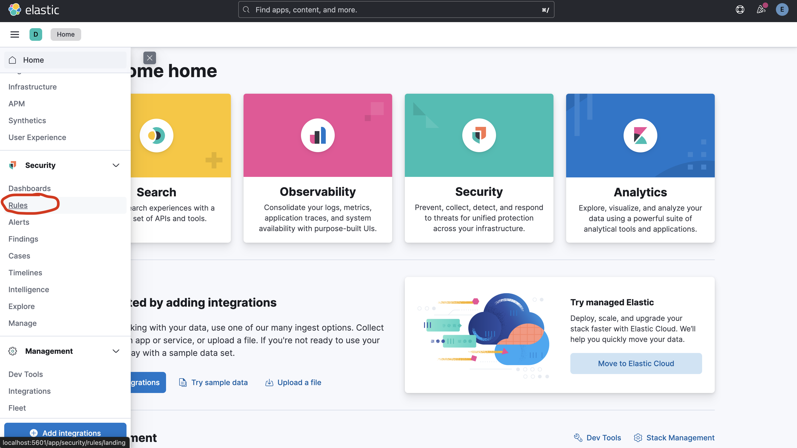
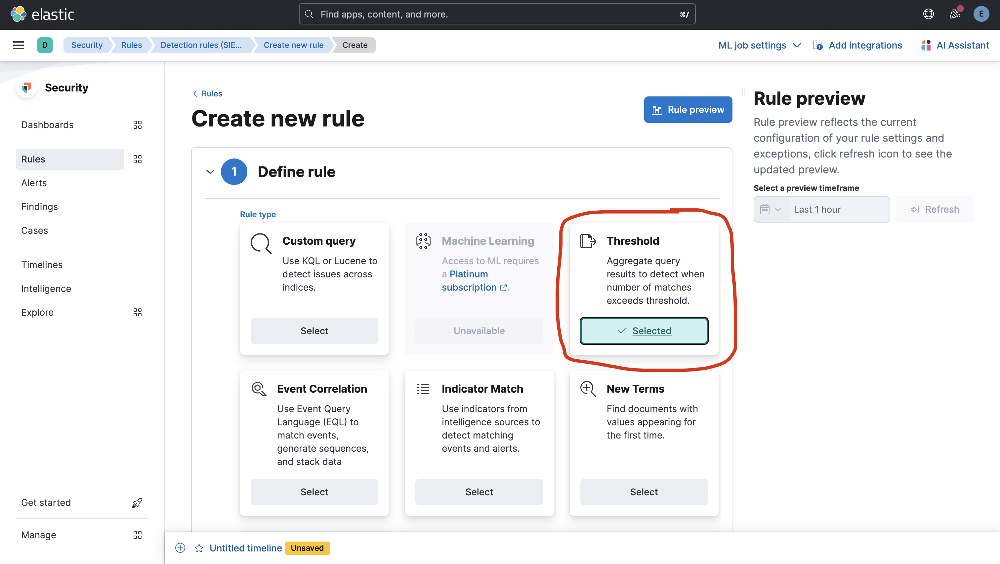
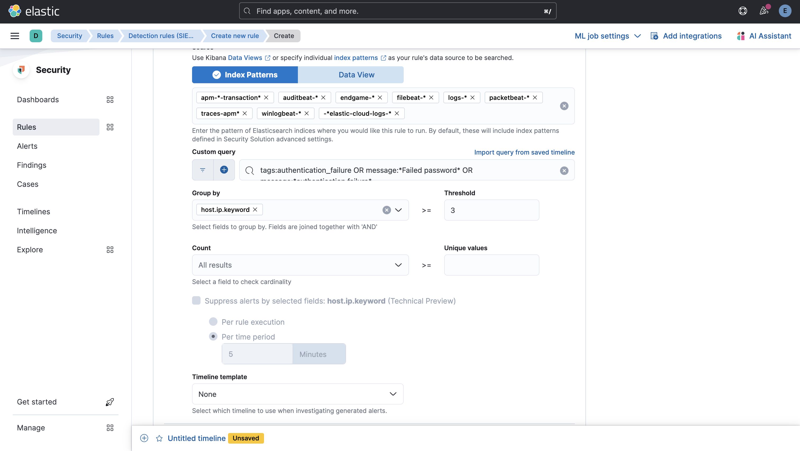
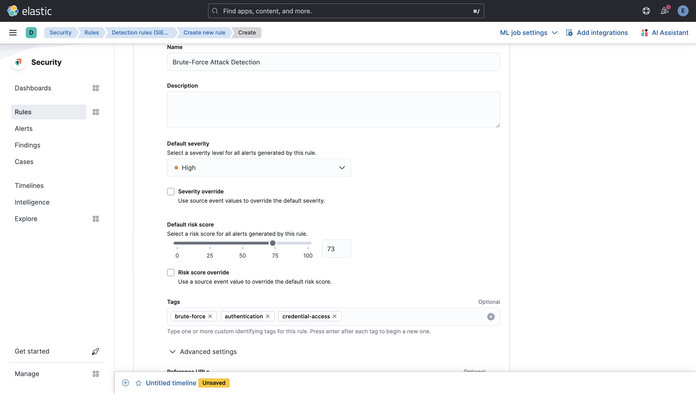
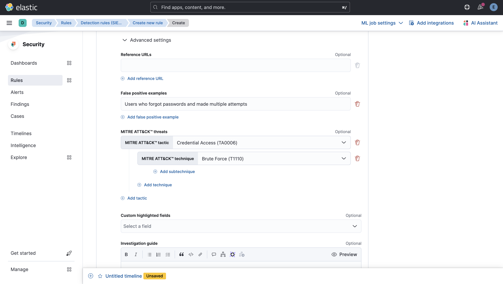
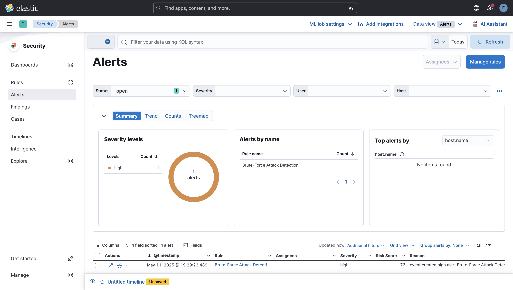
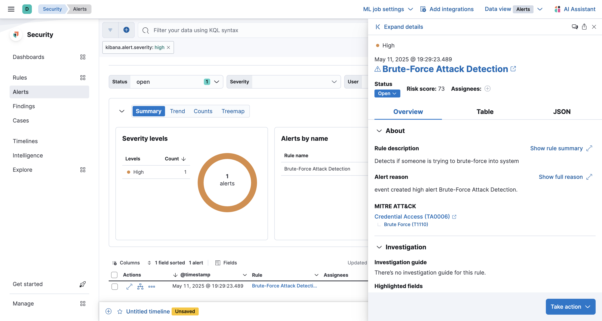

# Brute-Force Attack Detection with Elastic SIEM: Step-by-Step Guide

This guide walks through setting up a brute-force attack simulation environment and configuring Elastic SIEM to detect these attacks. The simulation helps understand how attackers attempt to gain unauthorized access through password guessing and how a SIEM can detect and alert on such activities.

## 1. Overview

All necessary files for this exercise are already included in the repository you've downloaded. The main components we'll be working with are:

- SSH target container (ssh-target) - The target of our simulated attack
- Hydra attacker container (hydra-attacker) - Used to perform the brute-force attack
- Logstash pipeline configuration - Already configured to parse SSH authentication logs
- Filebeat configuration - Already set up to collect logs from the SSH target
- Brute-force simulation script - Ready to execute the attack simulation

## 2. Start the Additional Containers

First, ensure you've deployed the main Elastic Stack components as described in the DEPLOYMENT.md file. Then, start the additional containers needed for this simulation:

```bash
sudo docker-compose up -d ssh-target hydra-attacker
```

This will start:
- An SSH server container that will be the target of our attack
- An attacker container with Hydra installed (a password-cracking tool)

## 3. Verify Components Are Ready

```bash
sudo docker-compose ps ssh-target hydra-attacker
```

Ensure both containers show a status of "Up".

## 4. Configure Kibana Detection Rule

1. Log in to Kibana at `http://localhost:5601`
2. Navigate to **Security** > **Rules** > **Detection rules (SIEM)** > **Create new rule**



3. Select **Threshold** rule type



4. Define the rule:
   - **Index patterns**: Include filebeat-* patterns
   - **Custom query**: `tags:authentication_failure OR message:*Failed password* OR message:*authentication failure*`
   - **Group by field**: `host.ip.keyword`
   - **Threshold**: 3
   - **Timeframe**: 5 minutes
     


5. Configure rule settings:
   - **Rule name**: "Brute-Force Attack Detection"
   - **Risk score**: 73
   - **Severity**: High
   - **Tags**: "brute-force", "authentication", "credential-access"
   - **MITRE ATT&CK**: Select "Credential Access" and "Brute Force (T1110)"
   - **False positive examples**: Add "Users who forgot passwords and made multiple attempts"



6. Set schedule:
   - **Runs every**: 5m
   - **Additional look-back time**: 1m



7. Save and enable the rule

## 5. Run the Simulation

The brute-force attack simulation script is already included in the repository. Execute it to simulate the attack:

```bash
sudo chmod +x simulation/run-brute-force.sh
sudo ./simulation/run-brute-force.sh
```

The script will:
- Create a password list in the hydra-attacker container
- Find the IP address of the ssh-target container
- Run a brute-force attack using Hydra with multiple password attempts
- Check if logs are being generated

## 6. Check Kibana for Alerts

After running the simulation:

1. Wait approximately 5-10 minutes for the detection rule to trigger
2. In Kibana, navigate to **Security** > **Alerts**
3. You should see an alert for "Brute-Force Attack Detection"



## 7. Analyzing the Alert

The alert shows:
- Multiple failed login attempts from the same IP address
- A timeline of the attack
- The exact authentication failure events
- The source IP address that initiated the attack
- The targeted username

You can click on the alert to see more details, including:
- All source and destination IP addresses
- All authentication attempts (failures and successes)
- Timestamps for each event



### Important!
Don't forget to shutdown and delete the containers for this scenario before moving on to the next one!

```bash
sudo docker-compose down ssh-target hydra-attacker -v
```

## 8. Troubleshooting

If you don't see alerts:

1. Check Logstash logs:
```bash
sudo docker logs logstash
```

2. Check Filebeat logs:
```bash
sudo docker logs filebeat
```

3. Verify logs are getting to Elasticsearch:
```bash
sudo curl -u elastic:elastic123 "http://localhost:9200/_search?q=tags:authentication_failure&pretty"
```

4. Verify your detection rule is enabled:
   - Go to Security > Rules
   - Check the status of your "Brute-Force Attack Detection" rule

## Conclusion

You have successfully set up a brute-force attack simulation environment and configured Elastic SIEM to detect these attacks. This hands-on experience demonstrates how security information and event management (SIEM) systems can identify and alert on potential security threats in real-time.

The simulation helps security professionals understand:
- How brute-force attacks are executed
- How to configure detection rules for authentication failures
- How to analyze security alerts in Elastic SIEM
- The importance of log collection and processing in security monitoring

This knowledge can be applied to enhance security monitoring in production environments and develop more sophisticated detection and response strategies.
