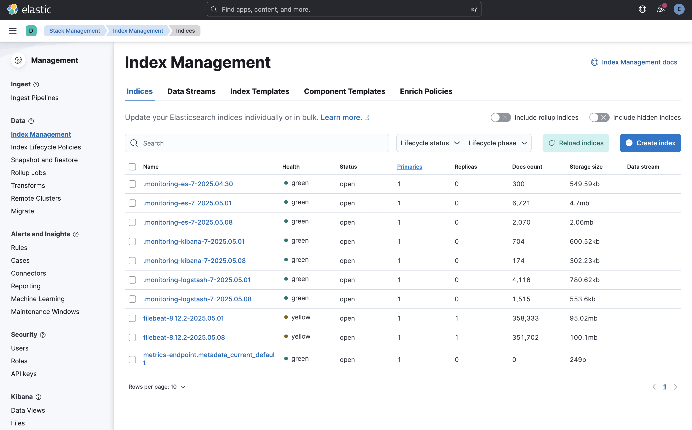

# Elastic Stack SIEM Deployment Guide

This guide provides step-by-step instructions for deploying the Elastic Stack SIEM solution.

## Prerequisites

- Docker Desktop installed
- At least 4GB of RAM allocated to Docker
- Git (for cloning the repository)

## Step 1: Clone the Repository

```bash
git clone https://github.com/Amid68/Elastic-SIEM-Project.git
cd Elastic-SIEM-Project
```

## Step 2: Generate SSL Certificates

Before configuring the environment, you need to generate SSL certificates for secure communication. Run the certificate generation script:

```bash
./generate_certs.sh
```

This script creates the necessary certificates in the `docker/elasticsearch/certs` directory:
- A Certificate Authority (CA) for signing certificates
- Node certificates for Elasticsearch transport layer security

These certificates enable encrypted communication within the Elasticsearch cluster and are required even for single-node deployments.

## Step 3: Configure Environment Variables

1. Navigate to the docker directory:
   ```bash
   cd docker
   ```

2. Edit the `.env` file to customize your deployment:
   ```bash
   nano .env
   ```

3. At minimum, change the following variables:
   - `ELASTIC_PASSWORD`: Set a strong password for the Elasticsearch admin user
   - `KIBANA_ENCRYPTION_KEY`: Set a random 32+ character string for Kibana encryption. For this you can use this command:
     
     ```
     openssl rand -base64 32
     ```
   - Adjust memory settings if needed based on your system resources

## Step 4: Deploy the Elastic Stack

1. Start the Elasticsearch container:
   ```bash
   docker-compose up -d elasticsearch
   ```

2. Wait for Elasticsearch to fully initialize (this may take a few minutes):
   ```bash
   docker-compose logs -f elasticsearch
   ```
   
   Wait until you see logs indicating that the service is running properly. Note that a YELLOW status is normal for a single-node cluster.

3. Once Elasticsearch is running, deploy Kibana:
   ```bash
   docker-compose up -d --no-deps kibana
   ```

4. After Kibana is running, deploy Logstash:
   ```bash
   docker-compose up -d --no-deps logstash
   ```

5. Finally, deploy Filebeat:
   ```bash
   docker-compose up -d --no-deps filebeat
   ```

   Note: Using the `--no-deps` flag is a workaround for health check issues that may mark Elasticsearch as unhealthy despite it functioning correctly.

## Step 5: Capture Network Traffic (for Network Intrusion Detection)

A script is included to capture network traffic using tcpdump and prepare it for ingestion by Filebeat:

1. Make sure you have the required tools installed:
   ```bash
   # For Linux
   sudo apt install wireshark
   
   # For Mac
   brew install wireshark

   # For Linux
   sudo apt-get install tshark
   ```

2. Run the capture script to collect network traffic:
   ```bash
   ./capture_traffic.sh
   ```

3. The script will capture traffic for 60 seconds by default and save it to `docker/network_logs/network_traffic.json` where Filebeat will automatically pick it up.

## Step 6: Access Kibana

1. Open a web browser and navigate to:
   ```
   http://localhost:5601
   ```

2. Log in with the following credentials:
   - Username: `elastic`
   - Password: The value you set for `ELASTIC_PASSWORD` in the `.env` file

## Step 7: Verify Data Collection

1. In Kibana, navigate to "Management" > "Stack Management" > "Data Views"

2. Create data views for your data sources:
   - Create a data view with pattern `filebeat-*` for log data
   - Create another data view with the same pattern to see network traffic data

3. If no indices appear immediately, wait a few minutes as data collection may take time to begin.



## Step 8: Stopping the Elastic Stack

To stop the Elastic Stack when not in use:

```bash
docker-compose down
```

To stop and remove all data (use with caution):

```bash
docker-compose down -v
```

## Troubleshooting

### Elasticsearch Won't Start

1. Check if you have enough memory allocated to Docker:
   ```bash
   docker info | grep "Total Memory"
   ```

2. Check Elasticsearch logs:
   ```bash
   docker-compose logs elasticsearch
   ```

3. Common issues:
   - Memory limits too low: Increase `ES_JAVA_OPTS` in `.env`
   - Permission issues: Check folder permissions
   - Port conflicts: Ensure ports 9200 and 5601 are not in use
   - Certificate issues: Re-run the `generate_certs.sh` script

### No Data in Kibana

1. Check if Filebeat is running:
   ```bash
   docker-compose ps
   ```

2. Check Filebeat logs:
   ```bash
   docker-compose logs filebeat
   ```

3. Verify Logstash is processing data:
   ```bash
   docker-compose logs logstash
   ```

### Environment Variable Issues

If you see errors about undefined environment variables:

1. Check that your `.env` file contains all required variables
2. Verify that the variables are properly referenced in your docker-compose.yml
3. For Logstash specifically, ensure the `ELASTIC_PASSWORD` variable is explicitly defined in the environment section
